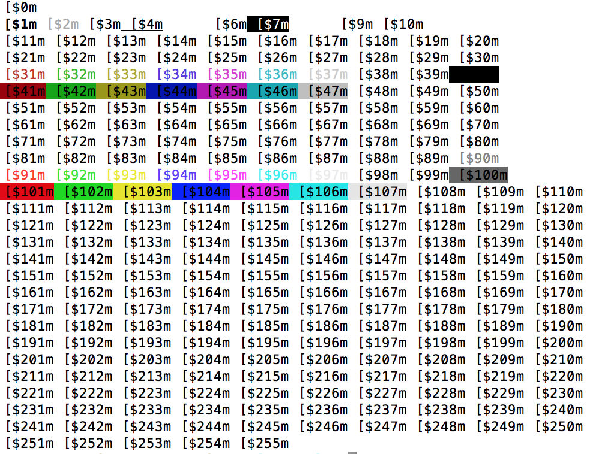

# bash-utils
Tips and tricks for bash.

## Sources
https://misc.flogisoft.com/bash/tip_colors_and_formatting

## Formatting codes ()


```bash

# bash-allcodes.sh

#!/bin/bash
for col in {0..255} ; do
        printf "\033[$%sm [$%sm\033[0m" $col $col

        if [ $(($col % 10)) == 0 ] ; then
                echo
        fi

done ;
echo
exit 0
```
These scripts have been tested in a bash OSX enviroment (OSX 10.11.6).

* __colors_16_and_formatting.sh__ displays a lot of possible combination of the attributes;
* __256-colors.sh__ displays the 256 colors available (foreground and background);
