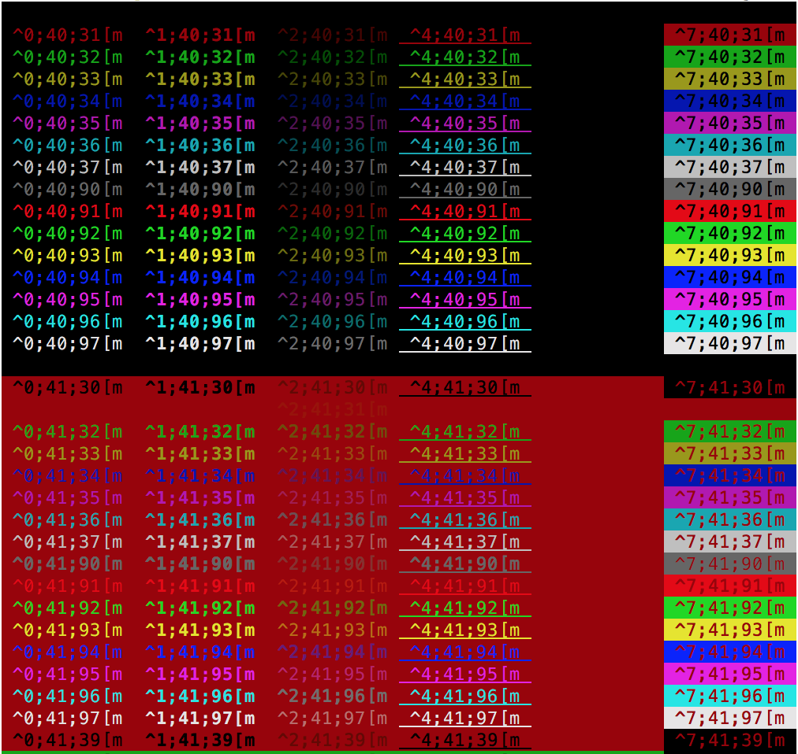
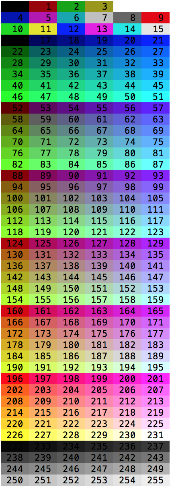

# bash-utils
Tips and tricks for bash.

## Sources
https://misc.flogisoft.com/bash/tip_colors_and_formatting

## Scripts
These scripts have been tested in a bash OSX enviroment (OSX 10.11.6).

### Formatting codes
Displays a list of formatting codes and their effect.


```bash

# bash-allcodes.sh

#!/bin/bash
for col in {0..255} ; do
        printf "\033[$%sm [$%sm\033[0m" $col $col

        if [ $(($col % 10)) == 0 ] ; then
                echo
        fi

done ;
echo
exit 0
```

### Colors and formatting (16 colors)
Displays a lot of possible combination of the attributes.



```bash

# colors_16_and_formatting.sh
#!/bin/bash

for backgroundColor in {40..47} {100..107} 49 ; do
        for foregroundColor in {30..37} {90..97} 39 ; do
                for attribute in 0 1 2 4 5 7 ; do
                        echo -en "\033[${attribute};${backgroundColor};${foregroundColor}m ^${attribute};${backgroundColor};${foregroundColor}[m \033[0m"
                done
                echo
        done
done

exit 0
```

### 256 colors
Displays the 256 colors available (foreground and background).



```bash

# 256-colors.sh
#!/bin/bash

for foregroundColor in 38 48 ; do
        for color in {0..255} ; do
                printf "\033[${foregroundColor};5;%sm %3s \033[0m" $color $color

        if [ $((($color + 1) % 6)) == 4 ] ; then
                echo
        fi
        done
        echo
done

exit 0
```

